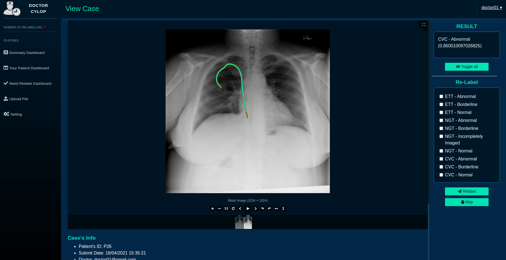

# Doctors Cyclop Webapp

Doctor Cyclop is one project of the Phoenix team in FPT Edu Hackathon 2021. This repository contains code of the web interface for interact with the system. For the  model, view [Doctor-Cyclop-Hackathon-2021](https://github.com/thaiminhpv/Doctor-Cyclop-Hackathon-2021).



## Requirements

- MeteorJS 2.1
- NodeJS 12
- MongoDB 4.2
- AWS S3

## Config

- Create file `.env` and copy content from `.env_dummy`. Fill in all information needed.
- You can change **MONGO_URL** or **ROOT_URL*** in file `run.sh`

## Setup model server
Run model server from this [repository](https://github.com/thaiminhpv/Doctor-Cyclop-Hackathon-2021). Then copy the url of model server to `Model Url` in setting page.

## Run 

Run file `run.sh` then open `http://localhost:3000` in your browser to access web app.
```
./run.sh
```

## Copyright and License
The template was developed based on [SB Admin 2](https://startbootstrap.com/theme/sb-admin-2).
